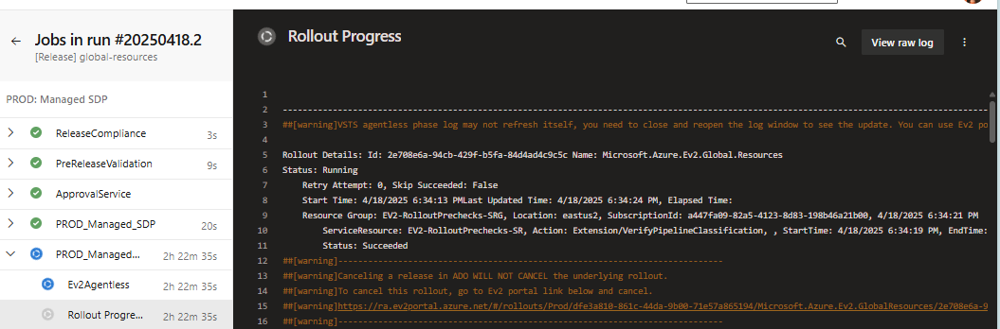
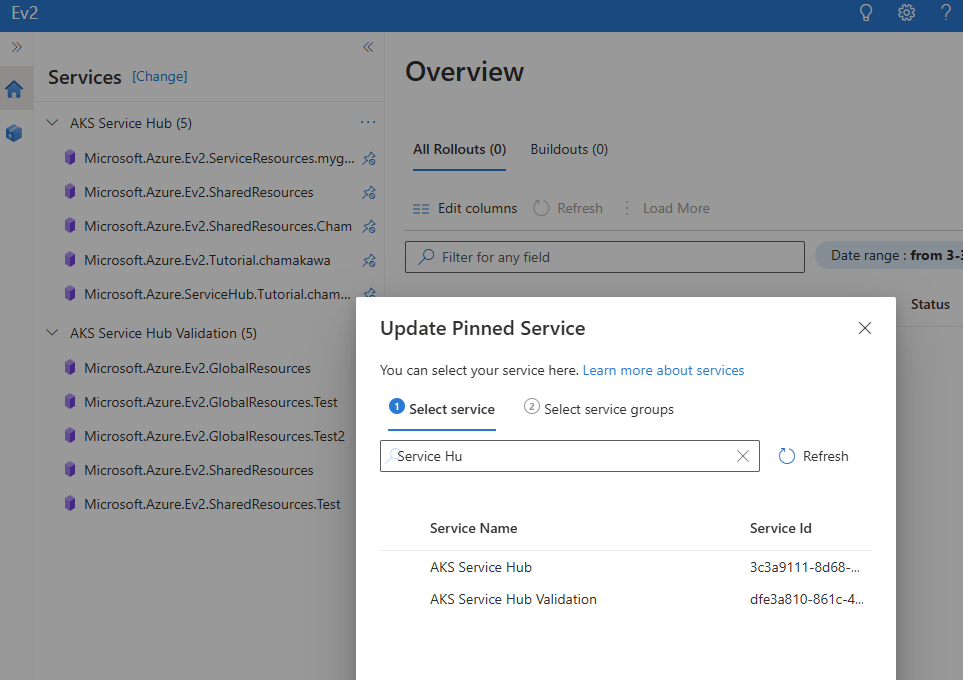
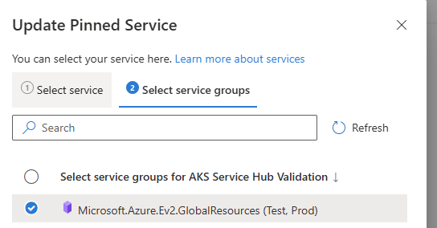
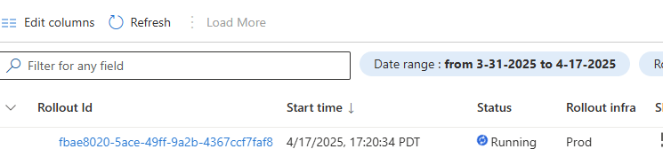

# Ev2 vs Normal Rollout

We currently have two processes to roll out the service.

## [Ev2](https://ev2docs.azure.net/getting-started/overview.html)

- For Test, Production (Azure public cloud), sovereign, and air-gapped clouds. More details about [Ev2 Cloud terminology](https://ev2docs.azure.net/getting-started/production/release-pipeline.html#what-is-new-in-governed-yaml-pipelines-with-ev2-managed-sdp).
- Uses a set of json config files (named artifacts) to orchestrate the deployment of your service.

## Normal Rollout

- For developer to test if the microservices can work together quickly.
- We provide a set of Makefile targets to orchestrate the deployment of your service. It doesn't use Ev2.

Ev2 rollout and normal rollout largely share the same files, so you will typically only have to make changes to your files once. There are a few notable differences described below.

## Files Shared by Ev2 and Normal Rollout

- all bicep files
- `template-ServiceResources.Parameters.json`
- `template-Main.SharedResources.Parameters.json`
- all files under the `deployments` directory of each service

## Files **NOT** Shared by Ev2 and Normal Rollout

There are several files that exist specifically for Ev2 buildout/rollout.

### Ev2 Specific

All files that are in the Ev2 directories. We have an Ev2 directory in shared-resources and service directory.

## Replacing Templated Values: Using `template-` files in Ev2

Files that contain [Go template "actions"](https://www.digitalocean.com/community/tutorials/how-to-use-templates-in-go#step-4-writing-a-template) need to be executed (replacing the placeholder with real value). They have the prefix `template-` in their file name. Examples include:

- `template-ServiceResources.Parameters.json`
- `template-Main.SharedResources.Parameters.json`
- `template-common-values.yaml`

The Ev2 rollout replaces these placeholders through the `ScopeBinding.json` file, while the normal rollout replaces these placeholders using the `env-config.yaml` file. The `env-config.yaml` is generated from the Makefile target in the README directory.

# Ev2 Setup

Make sure you have followed the necessary steps for Ev2 mentioned in the [Service Hub README.md](https://dev.azure.com/service-hub-flg/service_hub/_git/service_hub?path=/README.md&_a=preview).

## Pre-requisites for automatic Ev2 Test Infra rollout in Microsoft Corporate Tenant
### Ev2 Service Registration
// TODO: Automate this when doing rings? Should be possible.
- Register your service with Ev2 (in corporate tenant). Follow steps 2 and 3 in the [Ev2 Service Registration Docs](https://ev2docs.azure.net/features/policies/service-registration.html#2-author-your-service-specification-file) to set up your service with Ev2. You **must** use Ev2 Cli/Powershell Cmdlets on your normal corporate computer as service registrations are tied to the account's tenant.

### Request an AAD Security group 
  > **_NOTE:_** If you previously only created the 4 security groups we recommended (TM/AP for development and production resources), you have only 2 entitlements via CoreIdentity for Corp and 2 via OneIdentity in AME. **Neither of these 4 options unfortunately work for this situation.** The SGs created by CoreIdentity are labelled as AD security groups not AAD. Refer to [ev2 docs for more information](https://ev2docs.azure.net/getting-started/test/serviceprincipal.html)

- If you do not have a AAD security group (an Entra ID security group that service principals can be added to) request one by going to [this link](https://microsoft.service-now.com/sp?id=sc_cat_item&sys_id=eb69337ddb95181450423c9968961909&sysparm_category=8555d9e5136eea002620b0912244b0a3).
  - For the section that asks you "Business case why you need an AAD group versus IDWeb managed group", simply say that you need to create an AAD security group to be able to add service principal for 
- It will take a few days for them to do this for you. 

### Add your AAD Security group to Service Tree Metadata
Once you have an AAD SG you must add the security group to your service tree's access control metadata so that members of the security group are able to perfom Ev2 Releases.
  1. Navigate back to your service's entry in the service tree, and press on the "Metadata" tab.
  2. Under the left hand list, select "Access Control Configuration".
  3. And select the tabs for Security Groups for **Admin Access** Development Resources.
  4. Select the "Edit Metadata" option and add your AAD security group with the prefix "redmond\". It will look like "redmond\${youraadsecuritygroupname}"

### Creating an Ev2 Service Connection that uses Federated Identity Credentials
// TODO: Automate creation of Ev2 service connection. (Also split off user-environment stuff to provide a way to automate the creation of normal service connection and service principal so that can be re-used here)
1. We are assuming you already a service principal that is tied to the service connection that you use for the test/dev pipelines. If you do not have a service principal perform the steps below.
    - [Register a Microsoft Entra app and create a service principal](https://learn.microsoft.com/en-us/entra/identity-platform/howto-create-service-principal-portal)
2. Assign your service principal/app registration the "Owner" role to the backfilled subscription you have chosen for your Ev2 test infra rollouts.
    > **_NOTE:_** You will not be able to assign owner role unless your role is privileged. If you do not have the adequate permissions, reach out to someone who has owner role in the subscription and request them to give the service principal these capabilities.
    - Follow these [step by step instructions](https://learn.microsoft.com/en-us/entra/identity-platform/howto-create-service-principal-portal#assign-a-role-to-the-application) if you do not know how to do assign roles.
3. Add your service principal/app registration to the AAD Security group we referred to in the previous section.
    1. Navigate to your AAD security group in the Azure portal. If you do not know where it is select the Microsoft Entra ID panel and search for the security group name.
    2. Under the "Manage" section of the left hand side column, navigate to "Members".
    3. Select the "+ Add Members" button for Direct Members.
    4. Search for your app registration/service principal and select it once its found. Pressing the "select" button should add your service princiapl as a direct member to your security group.
4. Creating service connection and connecting it to the service principal via Federated Identity Credentials.
    1. In your chosen project, navigate to the "Project Settings" button and select it. 
    2. Select the "Service Connections" button underneath the "Pipelines" section of the settings.
    3. Select the New service connection button at the top right and look for the "Ev2 service connection" selection. It will automatically select Express V2 (Msinternal) below as well. Select the "next" button.
    4. Choose "Federated Identity Credentials" to be the authentication method.
    5. Choose "Test" to be the Target Infra.
    6. For "Service Principal Id", fill it in as the "Application (Client) Id" on your app registration/service principal that we refer to in the previous steps. It can be found in the Overview page for the resource
    7. For "Tenant ID", fill it in as the "Directory (tenant) Id" on your app registration/service principal. It can be found in the Overview page for the resource .
    8. Make sure to name your service connection as "ServiceHubValidation_Ev2TestCorpServiceConnection", as that is what is stored in your Official Build Pipeline.
    9. Press the save button.
    10. Copy and save the ID for the service connection after the service connection has been created, it will be right below the service connection name.
    11. On any page of your ADO project, right click on mouse and select the "View page source" button. Once you can see the page source, search for "hostId". Copy and save the value associated with the hostId as it will be needed for the federated credentials. This hostId represents your ADO system collection id.
      - (TODO: see if theres a cleaner way of doing this)
    12. Convert both your managed identity's tenant id and your ADO hostId to base64url encoded. If you do not know how to do this, you can use this link to do it for you. https://dotnetfiddle.net/p11CFZ
    13. Navigate to your service principal resource page in the azure portal (if you cannot find it, open the Microsoft Entra ID panel and search for your app registration).
    14. Select the "Certificates and Secrets" button under the "Manage" section in the left hand side column.
    15. Select the "Federated credentials" button and press the "+ Add credential button"
    16. For Federated credential scenario select "Other issuer"
    17. For "Sssuer", put "https://login.microsoftonline.com/{your tenant id}/v2.0"
    18. For "Value", put "/eid1/c/pub/t/{base64url encoded tenant id}/a/{base64url encoded ADO hostId}/{service connection id}"
    19. Choose whatever name you would like for the federated credential. It can also help to add the link for your service connection in the description if you want to make it easy to figure out.

### Creating Variable Group Locks
//TODO: Automate creation in user-environment terraform
- For each set of resources you plan on building/releasing we need to create a variable group that will act as a lock around the test infra rollout task. This will eliminate any possibilities of errors or failures due to multiple pipeline runs being run at the same time.
  - Follow these instructions to [create a variable group](https://learn.microsoft.com/en-us/azure/devops/pipelines/library/variable-groups?view=azure-devops&tabs=azure-pipelines-ui%2Cyaml#create-a-variable-group) and name it to be directoryName-lock for each directory you build/release for. i.e. One will be "shared-resources-lock". You can simply add a single empty/random variable as it will not be used but variable groups can't be created without a variable in the group.
## Prerequisite (For Geneva): Register OneCert Domain

Refer to [GenevaLogsSetUp.md](./GenevaLogsSetUp.md#step-1-register-domain) for how to do this.
  

## Setting up subscriptions for Ev2

### Using a pre-existing subscription instead of provisioning through Ev2

- If you want to use an existing subscription for all regions instead of provisioning a subscription for each release region, you will need to perform the following steps.
  - Remove `SubscriptionProvisioning.Parameters.json` from shared-resources\Ev2\Ev2Specs\Parameters
  - Remove the following code from `serviceModel.json` in shared-resources\Ev2\Ev2Specs

    ```json
      "subscriptionProvisioning": {
        "rolloutParametersPath": "Parameters\\SubscriptionProvisioning.Parameters.json",
        "scopeTags": [
          {
            "name": "sharedInputs"
          },
          {
            "name": "subscriptionInputs"
          }
        ]
      },
    ```

  - Follow the [steps](https://ev2docs.azure.net/features/service-artifacts/actions/subscriptionProvisioningParameters.html#subscription-registrationbackfill) to register your subscription as declarative  backfill.
  - Change how you define "subscriptionKey" in all your serviceModel.json files to match the key you registered your subscription with. Including the service specific models.
  - Follow the [instructions](https://ev2docs.azure.net/features/rollout-infra/prod.html) to give your security group team permissions to your subscription.

## What do the Ev2 files provide?

### Common through all directories

1. **Configurations** - Defines the tenant id/subscription key for the Ev2 rollout and rollout environment for each of the two options below.
    1. **Production**
    2. **Test**
2. **Templates** - Defines the resources that will be rolled out in accordance to ServiceModel.json
3. **Parameters** - Defines the parameters files used by resources defined in Templates and ServiceModel.json
4. **RolloutSpec.json** - Defines what resources to deploy from the service model and the order for deploying those resources
5. **ScopeBinding.json** - Scope bindings enable you to reuse your parameters across actions. It defines resource parameters for different environments without creating different files for every environment.
6. **ServiceModel.json** - Defines the Azure subscription, resource groups, and ARM templates.
7. **Version.txt** - The file that stores version of the Ev2 build. Written to by the build script.

### Global Resources specific

Currently, everything for global-resources is specific to the automation of the geneva setup in ev2. Please refer to the [Geneva Automation Explained doc](./GenevaLogsAutomationExplained.md) for more detailed information.

### **shared-resources** specific

1. Within **Templates**
    1. `AcrPush.SharedResources.Template.bicep`: Creates the identity and role assignment that allows for the publishing of the image to the ACR in our Ev2 pipeline. All microservices use these resources to publish the docker images to the ACR. In other words, these resources are *created* in shared resources, but are *used* by the services.
    2. `RoleAssignment.Subscription.Template.json`: Defines a variety of role assignments that get tied to the subscription we provision for the region we release in. The corresponding parameters file defines the exact role assignments that get created.
2. Within **Parameters**
    1. `AcrPush.SharedResources.Parameters.json`: Parameters file for `AcrPush.Sharedresources.Template.bicep`.
    2. `RoleAssignment.Subscription.Parameters.json`: Parameters file for `RoleAssignment.Subscription.Template.json`.
    3. `SubscriptionProvisioning.Parameters.json`: Parameters file used for provisioning the region based subscription defined in ServiceModel.json.
    4. `RegisterResourceProvider.Parameters.json`: Parameters file used for registering resource providers, specifically Microsoft.Compute such that clusters are able to deploy successfully.
    5. `Kubectl.Rollout.Parameters.json`: Defines the process to cluster for kubectl

### Delete specific
Please refer to the [Deletion Automation Explained doc](./DeletionAutomationExplained.md) for more detailed information.

### Service specific

1. **Templates**: This directory does not exist in the microservice directories. It is added in by the build pipeline during the build process. The build pipeline takes bicep files stored in serviceDirectoryName/resources and converts them to arm json files.
2. Within **Parameters**
    1. `Helm.Rollout.Parameters.json`: Defines the process to cluster for helm
    2. `PublishImage.Parameters.json`: Defines the process that pushes service image to acr.
3. **Shell**
    1. `push-image-to-acr`: The script used to push the service image to the acr.

## Build and Release with Ev2 through OneBranch Pipelines

We have created a generalized [build script](../pipeline-files/buildEv2Artifacts.sh) that can build global-resources, shared-resources and any service. The script gets called by the build pipeline to generate the required artifacts for an Ev2 Deployment.

### (Optional) Testing Builds Locally

The build script can be also be run locally if you want to see what artifacts will get published by the build pipeline.

Below are the required arguments the build script gets run with.

| Variable    | Purpose   |  Options |
|---|---|---|
|directoryName| The name of the directory you are performing the build for|e.g shared-resources|
|outputDir|The **full** path of the output directory you want the artifacts to be stored in |---|
|isService|Is the build for a service (true) or for resource (false). Resource means shared-resources or global-resources |true/false|
|rolloutInfra|Which configuration file gets used when building. |Prod/Test|
|buildNumber| The version that gets associated with this set of artifacts. However you decide to version local artifacts |e.g. "1.0.0" or "20240820" |
|isLocal| Are you building locally? | true/false |


For example, building artifacts for Ev2 for the shared-resources directory, can look like this.

```bash
./pipeline-files/buildEv2Artifacts.sh shared-resources ~/shared-artifacts false Prod "1.0.0" true
```

### (Optional) Adding customizations to builds

We understand that not every service will share the exact same minimum build that we have created, and might require additional files to be a part of the published artifacts. As a result, you can add a script under the **server** directory of your service with the name "buildCustomEv2.sh", and our build will automatically call it if the file exists.

### Creating OneBranch Build/Release Pipelines

1. The most basic build and release pipeline yaml files for shared and service specific resources have been provided. The build and release pipeline exists under **pipeline-files**. Below is a deeper description of what we provide.

| FileName   | Type   |  Purpose | Can be re-used? | Required Variables |
|---|---|---|---|---|
| OneBranch.Official.Build | Build | Build yaml file that builds service image, and calls a script that tests service, packages helm deployments files, converts bicep to arm json files, and compiles all files into an "artifact" directory. |Yes! As long as pipeline variables are changed as required and service directory holds expected structure.| <ul><li>directoryName: The name of the directory where the service/shared-resources code is located.</li><li>isService: true if the pipeline is for a service, false if it is for shared-resources.</li><li>rolloutInfra: Prod or Test based on which configuration file needs to be used</li><li>forceReinstallCredentialProvider: true (to avoid credential provider caching issues)</li><li>restrictToPR: Set to `"true"` if you want this pipeline to be restricted for branches to be able to only run from within a PR to allow for unique resources. It will work as expected for main branch.</li><li>regionNames: Comma seperated list of regions you want to release in (info in section below)</li>|
| OneBranch.Official.Release | Release | Release yaml file that links to the necessary service build pipeline, extracts the service artifacts from the build, and releases in the mentioned environments and regions. | Yes! As long as pipeline variables are changed as required| <ul><li>projectName: The name of the Azure Devops Project where the pipeline is located. </li><li>buildDefinitionId: The build definition id for the build pipeline you want to set this release pipeline for (info about how to obtain this is in step 3).</li><li>regionNames: Comma seperated list of regions you want to release in (info in section below)</li>|

1. For each Build and for each Release you will need to create a seperate OneBranch yaml pipeline. The recommended method can be found in these [instructions](https://eng.ms/docs/products/onebranch/onboarding/onebranchresources/newonebranchpipeline). Make sure to select existing yaml pipeline and select the corresponding yaml file stored. For both builds they will be in **pipeline-files**.

2. Once the pipelines are built, add the required variables mentioned in the above table.
  - **buildDefinitionId**: This will be an integer value. To get buildDefinitionId for release pipelines:
    - Go to the build pipeline for your specific directory/service. It should be the page where you can see all the Runs for the pipeline, not a specific run of that pipeline.
    - From the URL grab the definitionId.
    i.e 
      ```yaml
      # If your URL was below
      https://dev.azure.com/service-hub-flg/service_hub_validation/_build?definitionId=132
      # buildDefinitionId would be 132
      ```

## Releasing in certain regions or all regions

There are certain Azure resources and actions that can be used across subscriptions within the same tenant, provided they belong to the same environment (e.g., non-production or production). We define these resources as "global resources".

For global resources, we only want to release in one region: eastus2. To both build and release pipeline UI variables, you will need to add the variable regionNames to the pipeline and specify it as `eastus2`.

For non-global resources, we currently have 4 regions that we release in. To both build and release pipeline UI variables, you will need to add the variable regionNames to the pipeline and specify it as `australiaeast, eastus2, swedencentral, southeastasia`.

If you do not want to manually list all your release regions, you can use Ev2's concept of service presence. This will target all the regions that have presence in, so please make sure the regions you want to target have presence registered. If you are selecting specific regions, presence is not required to be registered.

- To register your service presence follow these [instructions](https://ev2docs.azure.net/getting-started/production/presence.html?q=service%20presence&tabs=powershell#one-time-registration-of-service-presence-for-existing-regions)
- Once you have registered your service in the regions, you can change the selection of regions in your release pipeline to the following line. This will release in **ALL** regions your service presence was registered in.

  ```
  Select: regions(*)
  ```

### Orchestrating Build and Release

1. Run the build pipeline.

The following artifacts will be published by the Ev2 Build
- For global-resources: drop_combineArtifacts_prepare
  - Ev2Specs
    - Build
      - config.zip
    - Configuration.json
    - Configurations
      - Prod
        - Configuration.json
      - Test
        - Configuration.json
    - Parameters
      - GenevaAccount.Rollout.Parameters.json
      - Main.GlobalResources.Parameters.json
      - RegisterResourceProvider.Parameters.json
      - RoleAssignment.Subscription.Parameters.json
      - SubscriptionProvisioning.Parameters.json
      - TemplateGenevaLogsExt.json
    - RolloutSpec.json
    - ScopeBinding.json
    - ServiceModel.json
    - Templates
      - Main.GenevaResources.Template.bicep
      - Main.GenevaResources.Template.json
      - RoleAssignment.Subscription.Template.json
      - create_table.bicep
      - create_table.json (generated from bicep, but not used explicitly)
      - data_connection.bicep
      - data_connection.json (generated from bicep, but not used explicitly)
    - Version.txt
- For shared-resources: drop_combineArtifacts_prepare
  - Ev2Specs
    - Build
      - argo-rollouts-namespace.yaml
      - install.yaml
    - Configuration.json
    - Configurations
      - Prod
        - Configuration.json
      - Test
        - Configuration.json
    - Parameters
      - AcrPush.SharedResources.Parameters.json
      - Main.SharedResources.Parameters.json
      - RoleAssignment.Subscription.Parameters.json
      - SubscriptionProvisioning.Parameters.json
      - RegisterResourceProvider.Parameters.json
    - RolloutSpec.json
    - ScopeBinding.json
    - ServiceModel.json
    - Templates
      - AcrPush.SharedResources.Template.bicep
      - AcrPush.SharedResources.Template.json
      - Main.SharedResources.Template.bicep
      - Main.SharedResources.Template.json
      - RoleAssignment.Subscription.Template.json
    - Version.txt
- For service specific: drop_combineArtifacts_prepare
  - Ev2Specs
    - Build
      - serviceDirectoryName-0.1.0.tgz
      - serviceDirectoryName-image-metadata.json
      - serviceDirectoryName-image.tar
      - values-client.yaml
      - values-common.yaml
      - values-demoserver.yaml
      - values-server.yaml
    - Configuration.json
    - Configurations
      - Prod
        - Configuration.json
      - Test
        - Configuration.json
    - Parameters
      - ServiceResources.Parameters.json
      - Helm.Rollout.Parameters.json
      - PublishImage.Parameters.json
    - RolloutSpec.json
    - ScopeBinding.json
    - ServiceModel.json
    - Shell
      - LICENSE
      - README.md
      - crane
      - crane.tar.gz
      - gcrane
      - push-image-to-acr.sh
    - Templates
      - Azuresdk.ServiceResources.Template.bicep
      - Azuresdk.ServiceResources.Template.json
    - Version.txt
    - push-image-to-acr.tar

1. Run the release pipeline with your selected parameters.
    - Releasing with the latest build version: Simply run without changing the Artifact Build Id, as the default variable will use the latest build version.
    - Releasing with a specific build version: 
      - Go to the specific build pipeline run for which you want to run a release for. 
      - From the pipeline's URL grab the buildId.
        i.e 
        ```yaml
        # If your URL was below
        https://dev.azure.com/service-hub-flg/service_hub_validation/_build/results?buildId=7254&view=results
        # BuildId would be 7254
        ```
      - Run the pipeline and set the pipeline parameter for "Artifact Build Id" to be the build id you got from the URL.
2. Once the release pipeline has completed its "PreReleaseValidation" job, it will start it's "ApprovalService" job. The pipeline runner will receive an email with a link to the [approval service page](https://approval.azengsys.com/Home/PendingRelease). A person on the release approvers team (that is not the submitter) must approve the release before the pipeline can go any further.
3. In order to locate the artifact version for the release you have run check the logs for the task "Ev2 Managed SDP Rollout" in job "PROD_Managed_SDP".
    - You will find a line that will be checking for the artifact's registration and it will list the version. i.e
      ```yaml
      Checking registration of the artifacts version 20250205.1.
      ```
4. Monitor Ev2 rollout by using the link provided in the release pipeline's "PROD_Managed_SDP_Monitoring" job's logs.

# Additional Information

## Helpful Ev2 Docs

- [Getting Started](https://ev2docs.azure.net/getting-started/overview.html)
- [Overview of Service Artifacts](https://ev2docs.azure.net/features/service-artifacts/service_artifacts_overview.html)
- [Actions in Ev2 Explained for Rollout Orchestration](https://ev2docs.azure.net/features/rollout-orchestration/actions.html?q=actions)
- [Actions in Ev2 for Service Artifacts](https://ev2docs.azure.net/features/service-artifacts/actions/overview.html) Includes kubernetes application deployment action.
- [Helm Application Deployment to Kubernetes in Ev2](https://ev2docs.azure.net/features/service-artifacts/actions/kubernetes-app/helm/app-modeling.html?q=helm%20appli&tabs=tabid-1)
- [Shell Extension Artifacts](https://ev2docs.azure.net/features/service-artifacts/actions/shell-extensions/artifacts.html)
- [Shell Extension Overview](https://ev2docs.azure.net/features/service-artifacts/actions/shell-extensions/overview.html?q=shell%20extension)
- [Publish Image to ACR in Ev2](https://eng.ms/docs/cloud-ai-platform/azure-edge-platform-aep/aep-engineering-systems/productivity-and-experiences/ce-legacy-infrastructure/onebranch/build/containerbasedworkflow/dockerimagesandacr/publishdockerimagesusingev2)
- [Store Helm Charts](https://learn.microsoft.com/en-us/azure/container-registry/container-registry-helm-repos)

## Deploying Service Components

We currently have our service artifacts set up such that we can deploy our service components (client, server, and demoserver) in parallel. Should you want to deploy your components sequentially, follow the sequential deployment example below. You will need to change the SRDef in your ServiceModel.json.

### Parallel Deployment (Current)

Separate out the different components of the service such that they can deploy in parallel.

RolloutSpec.json

```json
    {
      "name": "HelmDeploy-serviceDirectoryName-server",
      "targetType": "ApplicationDefinition",
      "applications": {
        "names": [
          "serviceDirectoryNameserver"
        ],
        "actions": [
          "AppDeploy"
        ],
        "applyAcrossServiceResources": {
          "definitionName": "serviceDirectoryNameserver-SRDef"
        }
      },
      "dependsOn": [
        "DeployServiceResources",
        "PublishImageToAcr"
      ]
    },
    {
      "name": "HelmDeploy-serviceDirectoryName-demoserver",
      "targetType": "ApplicationDefinition",
      "applications": {
        "names": [
          "serviceDirectoryNamedemoserver"
        ],
        "actions": [
          "AppDeploy"
        ],
        "applyAcrossServiceResources": {
          "definitionName": "serviceDirectoryNamedemoserver-SRDef"
        }
      },
      "dependsOn": [
        "DeployServiceResources",
        "PublishImageToAcr"
      ]
    }
```

ServiceModel.json

```json
        {
          "name": "serviceDirectoryNameclient-SRDef",
          "composedOf": {
            "application": {
              "names": [
                "serviceDirectoryNameclient"
              ]
            },
            "extension": {
              "rolloutParametersPath": "Parameters\\Helm.Rollout.Parameters.json"
            }
          },
          "scopeTags": [
            {
              "name": "sharedInputs"
            },
            {
              "name": "HelmInputs"
            }
          ]
        },
        {
          "name": "serviceDirectoryNameserver-SRDef",
          "composedOf": {
            "application": {
              "names": [
                "serviceDirectoryNameserver"
              ]
            },
            "extension": {
              "rolloutParametersPath": "Parameters\\Helm.Rollout.Parameters.json"
            }
          },
          "scopeTags": [
            {
              "name": "sharedInputs"
            },
            {
              "name": "HelmInputs"
            }
          ]
        },
        {
          "name": "serviceDirectoryNamedemoserver-SRDef",
          "composedOf": {
            "application": {
              "names": [
                "serviceDirectoryNamedemoserver"
              ]
            },
            "extension": {
              "rolloutParametersPath": "Parameters\\Helm.Rollout.Parameters.json"
            }
          },
          "scopeTags": [
            {
              "name": "sharedInputs"
            },
            {
              "name": "HelmInputs"
            }
          ]
        },
```

### Sequential Deployment

RolloutSpec.json

```json
    {
      "name": "HelmDeploy-serviceDirectoryName",
      "targetType": "ApplicationDefinition",
      "applications": {
        "names": [
            "serviceDirectoryNameclient",
            "serviceDirectoryNameserver",
            "serviceDirectoryNamedemoserver"
        ],
        "actions": [
          "AppDeploy"
        ],
        "applyAcrossServiceResources": {
          "definitionName": "serviceDirectoryName-SRDef"
        }
      },
      "dependsOn": [
        "DeployServiceResources",
        "PublishImageToAcr"
      ]
    }
```

ServiceModel.json

```json
        {
          "name": "serviceDirectoryName-SRDef",
          "composedOf": {
            "application": {
              "names": [
                "serviceDirectoryNameclient",
                "serviceDirectoryNameserver",
                "serviceDirectoryNamedemoserver"
              ]
            },
            "extension": {
              "rolloutParametersPath": "Parameters\\Helm.Rollout.Parameters.json"
            }
          },
          "scopeTags": [
            {
              "name": "sharedInputs"
            },
            {
              "name": "HelmInputs"
            }
          ]
        }
```

## To view your rollout in the Ev2 Portal

### Option 1

Navigate to the release, select `Prod_Managed_SDP_Monitoring` and then select `Rollout Progress`. You will see a link that starts with `ra.ev2portal.azure...net`. Select that link.
, 

https://ev2docs.azure.net/TroubleShooting/general/role-assignment-issues.html#solution-2

### Option 2

Go to [https://ra.ev2portal.azure.net/](https://ra.ev2portal.azure.net/). Select your service (name associated with service tree id) and the service group (i.e. "Microsoft.Azure.servicehubval.GlobalResources"). You can find the service group by checking the `ServiceModel.json` file for your release and checking the `serviceGroup` value. Click the latest Rollout Id, or the one that is associated with your release.









## Variable replacement in Ev2 (Bindings)

In Ev2 files, some values are represented as placeholders (e.g., {{.oneCertRegisteredDomain}}), which are dynamically replaced during deployment. However, only specific files support value replacement. Ev2 enables dynamic scope binding at deployment time, allowing a single templatized parameter or configuration file to be bound to scope-specific values. For more details on setting this up and identifying which files support templated values, refer to this [documentation](https://ev2docs.azure.net/features/service-artifacts-parameterization/bindings.html?q=binding).
