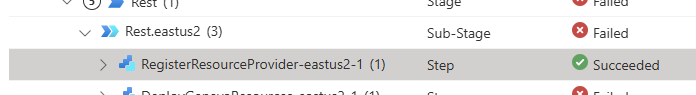
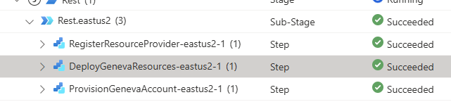
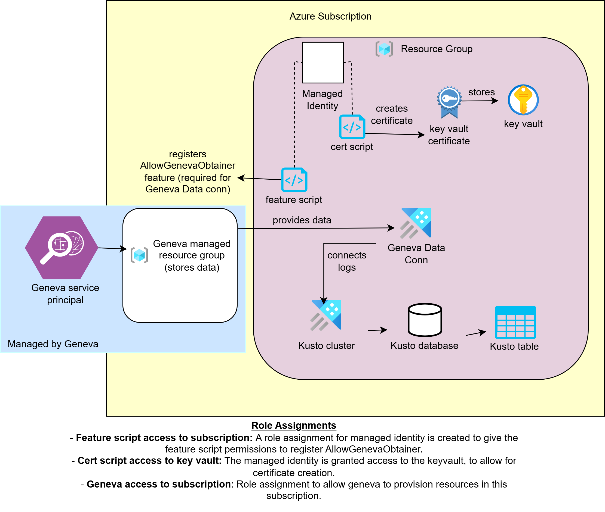
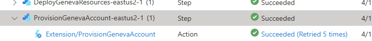

# Geneva Logs Automation Steps in Ev2 - Explained

The purpose of this document is to give users a better understand of what automation is occurring.

For detailed instructions on how to purely set up geneva, refer to [GenevaLogsSetUp.md](./GenevaLogsSetUp.md).

## Table of Contents

- [Geneva Logs Automation Steps in Ev2 - Explained](#geneva-logs-automation-steps-in-ev2---explained)
  - [Table of Contents](#table-of-contents)
  - [Geneva Automation Steps in Ev2 - Overview](#geneva-automation-steps-in-ev2---overview)
  - [Overview of Geneva Logs Account Automation (Global Resources)](#overview-of-geneva-logs-account-automation-global-resources)
    - [Step 1: Register a domain in OneCert](#step-1-register-a-domain-in-onecert)
    - [Step 2: Subscription Provisioning \[Prod Only\]](#step-2-subscription-provisioning-prod-only)
    - [Step 3: Register Resource Provider](#step-3-register-resource-provider)
    - [Step 4: Deploy Geneva Resources](#step-4-deploy-geneva-resources)
      - [Geneva Resource Deployment Overview](#geneva-resource-deployment-overview)
      - [Notes:](#notes)
    - [Step 5: Provision Geneva Account](#step-5-provision-geneva-account)
      - [`main.xml` Configuration File](#mainxml-configuration-file)
        - [Docs for Configuration](#docs-for-configuration)
      - [Granting Ev2 Approver Access to Key Vault Cert](#granting-ev2-approver-access-to-key-vault-cert)
  - [Overview of Geneva Agent Automation (Shared Resources)](#overview-of-geneva-agent-automation-shared-resources)
    - [Step 1: Resources for Agent Authentication](#step-1-resources-for-agent-authentication)
    - [Step 2: Deploying the Geneva Agents](#step-2-deploying-the-geneva-agents)
      - [Components Deployed on Each Node in the Cluster](#components-deployed-on-each-node-in-the-cluster)
      - [Key Configuration for Geneva Agent Authentication](#key-configuration-for-geneva-agent-authentication)

## Geneva Automation Steps in Ev2 - Overview

This document provides a high-level overview of the Geneva automation process.

Geneva automation consists of two major steps:
1. **Geneva Account Creation**: Setting up the Geneva logs account and required resources.
2. **Geneva Agent Deployment**: Deploying an agent to collect and forward logs.

The Geneva account creation process involves:
- **Resource Provider Registration**: Enabling Geneva to provision required resources like Event Hub namespaces and storage accounts.
- **Domain Registration**: Registering a domain in OneCert to enable certificate creation.
- **Subscription Provisioning**: Creating a dedicated subscription for Geneva resources.
- **Provisioning Resources**: Setting up a Key Vault, certificates, and a Kusto cluster for log storage.
- **Account Setup**: Using the Ev2 Geneva Logs extension to create and manage the Geneva logs account.

The Geneva agents deployment process includes:
- **mdsd Agent**: Collects logs and forwards them to Geneva.
- **Fluentd**: Collects Kubernetes logs and sends them to `mdsd`.
- **Metrics Extension (mdm)**: Collects and forwards metrics (not currently automated).

By automating these steps, the AKS cluster is fully integrated with Geneva for log and metrics collection.

Key concepts:

- **Domain Registration**: Each tenant and environment (e.g., `ame.prod.myservice.azure.net`) must have a domain registered in OneCert to enable certificate creation.
- **Dedicated Subscription**: Geneva resources are stored in a dedicated subscription, which is automatically provisioned during the first rollout.
- **Authentication**: The monitoring agent (`mdsd`) on the AKS cluster uses a key vault certificate to authenticate with Geneva.

## Overview of Geneva Logs Account Automation (Global Resources)
The following table outlines the key steps involved in Geneva automation, their automation levels, purposes, and relevant documentation or resources.

| Step # | Step Name                     | Automation Level         | Description/Purpose                                                                                                                                                                                                 | Docs/Resources                                                                                                                                                                                                                       | Manual Steps                                                                                     |
|--------|-------------------------------|--------------------------|---------------------------------------------------------------------------------------------------------------------------------------------------------------------------------------------------------------------|-----------------------------------------------------------------------------------------------------------------------------------------------------------------------------------------------|--------------------------------------------------------------------------------------------------|
| 1      | OneCert Registration          | Manual       | Registers a domain. | [OneCert Docs](https://aka.ms/onecertdocs)               | Navigate to the OneCert portal to register a domain. We provide the inputs for you. Refer to [GenevaLogsSetUp.md](./GenevaLogsSetUp.md) for more details. This is for certificate creation.                                         |
| 2      | Subscription Provisioning [Prod Only]    | Fully Automated in Ev2   | Provisions a subscription named `AKS Service Hub Validation Sub - global` during the first rollout and registers its ID with OneCert. After completion, the subscription ID will appear in the OneCert portal for your domain registration. This allows certificates to be created in your provisioned subscription. This subscription holds the Geneva provisioned resources (managed by Geneva), and resources that we provision for Geneva.                                                     | [Subscription Provisioning Docs](https://ev2docs.azure.net/features/service-artifacts/actions/subscriptionProvisioningParameters.html?q=subscription%20provisioning), [Ev2 OneCert](https://ev2docs.azure.net/features/service-artifacts/actions/subscriptionProvisioningParameters.html#tying-subscription-to-pre-registered-certificate-domains)                                                                | N/A                                                                                              |
| 3      | Register Resource Provider    | Fully Automated in Ev2   | Registers required resource providers (`Microsoft.Insights`, `Microsoft.Storage`, `Microsoft.EventHub`) to enable Geneva to provision resources like Event Hub namespaces and storage accounts.                     | [Ev2 Resource Provider Registration Docs](https://ev2docs.azure.net/features/service-artifacts/actions/http-extensions/shared-extensions/Microsoft.AzureGlobal.ResourceProviderRegistration.html), [Geneva Subscription Prerequisites](https://eng.ms/docs/products/geneva/logs/howtoguides/manageaccount/subscriptionpermissions)                                         | N/A                                                                                              |
| 4      | Deploy Geneva Resources       | Fully Automated in Ev2   | Creates all resources needed for the Geneva account but are not created by Geneva, including a key vault, certificate for the Geneva account creation authentication, Kusto cluster, data connection, and more. We also grant rbac access to the Geneva service principal to make changes to the provisioned subscription.                                                           | N/A                                                                                                                                                                                                                                   | N/A                                                                                              |
| 5      | Provision Geneva Account      | Partially Automated in Ev2   | Uses the Ev2 extension to declaratively provision and maintain the Geneva Logs account. This account stores logs and forwards them to resources like the Kusto cluster.                                             | [Geneva Logs Extension Docs](https://ev2docs.azure.net/features/service-artifacts/actions/http-extensions/shared-extensions/Microsoft.Geneva.Logs.html?q=geneva%20logs), [mdsd configuration schema](https://eng.ms/docs/products/geneva/collect/references/schema)                                                             | There are a couple of errors you will face. We detail how to resolve them in [GenevaLogsSetUp.md](./GenevaLogsSetUp.md)                         |

We exclude the set up of the build and release pipelines from this flow. We will assume you have set them up.

### Step 1: Register a domain in OneCert

This step is manually done in the OneCert portal [aka.ms/onecert](https://aka.ms/onecert) on your SAW. If this is not set up, certificates cannot be created, and Ev2 will be unable to create the geneva logs account. You will need register a domain for every environment within a tenant. For instance, you will have a separate domain name registration for ame prod and ame non-prod.

For more information, read these [docs](https://aka.ms/onecertdocs).

### Step 2: Subscription Provisioning [Prod Only]

Subscription provisioning will not occur in MS CORP or GME tenants. So if you are deploying to the CORP tenant via our Test Infra, this step does not apply.

**This step only occurs once.** You cannot change it afterwards, and it will not show up following the first rollout. The subscription is provisioned to store Geneva dedicated resources. The subscription will be used to store resources created by us for Geneva, and resources created and managed by Geneva itself.

It will look like this in your Ev2 rollout portal.

When this subscription is provisioned, we have configured it to register its subscription id with your OneCert registered domain. Refer to the [docs](https://ev2docs.azure.net/features/service-artifacts/actions/subscriptionProvisioningParameters.html?q=subscription%20provisioning) for more informations on subscription provisioning, and the [OneCert section](https://ev2docs.azure.net/features/service-artifacts/actions/subscriptionProvisioningParameters.html#tying-subscription-to-pre-registered-certificate-domains) for details about the OneCert subscription provisioning configuration.

### Step 3: Register Resource Provider

In your Ev2 rollout, this is the first step that shows up for the region.

It registers required resource providers (Microsoft.Insights, Microsoft.Storage, Microsoft.EventHub) to enable Geneva to provision resources like Event Hub namespaces and storage accounts. It is explicitly listed as a prerequisite for Geneva in the [docs](https://eng.ms/docs/products/geneva/logs/howtoguides/manageaccount/subscriptionpermissions). This step allows for the Geneva service principal to create resources such as event hub namespaces and storage accounts.

### Step 4: Deploy Geneva Resources

All Geneva resources are deployed by the file called `Main.GenevaResources.Template.bicep` in the global-resources directory. We left comments detailing the purpose of each resource, but we'll also outline it here.

#### Geneva Resource Deployment Overview

The diagram outlines the resources created and the workflow. The "Managed by Geneva" resources are created when the Geneva account is created in the following step.

The following table outlines the Geneva resources deployed by the `Main.GenevaResources.Template.bicep` file, their descriptions, purposes, and relevant documentation.

| Name                          | Description                                                                                                                                                                                                 | Docs                                                                                                                                                                                                                                   | Purpose                                                                                       |
|-------------------------------|-------------------------------------------------------------------------------------------------------------------------------------------------------------------------------------------------------------|---------------------------------------------------------------------------------------------------------------------------------------------------------------------------------------------------------------------------------------|-----------------------------------------------------------------------------------------------|
| **rg**                        | Creates the resource group where the Geneva resources reside.                                                                                                                                              | N/A                                                                                                                                                                                                                                   | Ensures all Geneva resources are grouped together in a single resource group.                |
| **scriptIdentity**           | Managed Identity for Geneva setup. Used to run scripts that create the Key Vault certificate and register the `AllowGenevaObtainer` feature for Kusto.                                                     | N/A                                                                                                                                                                                                                                   | Enables automation of Geneva setup tasks like certificate creation and feature registration. |
| **keyvault**                 | Creates a Key Vault to store the Geneva account certificate, which is used by the Ev2 extension as its identity to create the Geneva account.                                                                                       | [Geneva Key Vault Docs](https://eng.ms/docs/products/geneva/getting_started/environments/servicefabric/keyvault), [Ev2 Key Vault Docs](https://ev2docs.azure.net/features/service-artifacts/actions/http-extensions/shared-extensions/Microsoft.Geneva.Logs.html) | Stores the certificate required for Geneva account creation.                                 |
| **certCreationScriptDeployment** | Deploys a script to create the Key Vault certificate for Geneva account creation. This certificate is used by the Ev2 extension as its identity to create the Geneva account.                                                                                                                      | [Geneva Key Vault Docs](https://eng.ms/docs/products/geneva/getting_started/environments/servicefabric/keyvault), [Ev2 Key Vault Docs](https://ev2docs.azure.net/features/service-artifacts/actions/http-extensions/shared-extensions/Microsoft.Geneva.Logs.html) | Automates the creation of the Geneva account certificate.                                    |
| **registrationScriptRoleAssignment** | Assigns contributor access to the script identity at the subscription level to allow it to register the `AllowGenevaObtainer` feature for Kusto.                                                      | N/A                                                                                                                                                                                                                                   | Grants the script identity the necessary permissions to register the feature.                |
| **registrationScriptDeployment** | Deploys a script to register the `AllowGenevaObtainer` feature for Kusto.                                                                                                                                | [Kusto Feature Registration Docs](https://kusto.azurewebsites.net/docs/kusto/ops/manage-geneva-dataconnections.html#prerequisites)                                                                                                   | Enables the creation of data connections between Geneva and Kusto.                           |
| **kustoCluster (and database)** | Creates a Kusto cluster and database to store Geneva logs. "AllDatabasesView" access is granted to the specified production and corporate security groups, allowing their members, including those in the corporate tenant, to view the logs.                                                                                                                                            | N/A                                                                                                                                                                                                                                   | Provides a storage and query platform for Geneva logs.                                       |
| **kustoDatabaseTable**               | Creates a table in the Kusto database for Geneva logs.                                                                                                                                                     | N/A                                                                                                                                                                                                                                   | Defines the schema for storing Geneva logs in Kusto.                                         |
| **dataConnection**    | Creates a data connection between the Geneva account and the Kusto cluster.                                                                                                                                | [Kusto Data Connection Docs](https://kusto.azurewebsites.net/docs/kusto/ops/manage-geneva-dataconnections.html#prerequisites)                                                                                                        | Streams logs from Geneva to the Kusto cluster.                                               |
| **genevaRoleAssignment**      | Assigns the Geneva service principal the necessary role to provision storage accounts and Event Hub namespaces in the subscription. The Geneva service principal id and the role definition id are currently hardcoded in the ev2 files `Configuration.json`. To see how we obtain the hardcoded values, refer to [Geneva Prerequisites](https://eng.ms/docs/products/geneva/logs/howtoguides/manageaccount/subscriptionpermissions).                                                                         | [Geneva Prerequisites](https://eng.ms/docs/products/geneva/logs/howtoguides/manageaccount/subscriptionpermissions)                                                                             | Grants Geneva read/write access to the subscription for resource provisioning.               |

#### Notes:
1. **Key Vault and Certificate**: The Key Vault is used to store the certificate required for Geneva account creation. The certificate must be created using OneCert, and the domain must be registered in OneCert beforehand.
2. **Kusto Setup**: The `AllowGenevaObtainer` feature must be registered to enable Geneva to create data connections to Kusto. This is handled via a script in the Bicep file.
3. **Role Assignments**: The Geneva service principal and script identity are granted specific roles to enable resource provisioning by Geneva and feature registration.

### Step 5: Provision Geneva Account

We use the [Ev2 Geneva Logs extension](https://ev2docs.azure.net/features/service-artifacts/actions/http-extensions/shared-extensions/Microsoft.Geneva.Logs.html) to set this up.

#### `main.xml` Configuration File

The `main.xml` file in `README` configures the monitoring agent (`mdsd`) for the Geneva logs account. [Here](https://eng.ms/docs/products/geneva/collect/references/schema) is the schema for this file. It defines which logs to collect from `fluentd`, their destinations (e.g., Kusto tables), and whether they are forwarded to Kusto. This is required for the extension, and we configure this for you.  Azure Security Pack functionality is fully provided by azure-mdsd, so parts of the configuration file are for Azure Security Pack functionality.

##### Docs for Configuration

[MDSD Configuration Schema](https://eng.ms/docs/products/geneva/collect/references/schema)

[Collecting Telemetry on Linux](https://eng.ms/docs/products/geneva/collect/instrument/linux/overview)

[Geneva AzSecPack Configuration](https://dev.azure.com/msazure/One/_git/Compute-Runtime-Tux-GenevaContainers?path=/azsecpack&version=GBmaster)

#### Granting Ev2 Approver Access to Key Vault Cert

Steps on how to grant access are specified [here](./GenevaLogsSetUp.md#error-1-ev2-pipeline-cert-access).

We grant the Ev2 release approver access to the key vault cert. We technically specify "Key Vault Secrets User" since the Ev2 extension requires us to refer to a secret, and when a certificate is created, an addressable key and secret are also created with the same name. This information is from these docs: [about-keys-secrets-certificates](https://learn.microsoft.com/en-us/azure/key-vault/general/about-keys-secrets-certificates#object-types).

## Overview of Geneva Agent Automation (Shared Resources)

The Geneva agent setup consists of two main steps, which are included as part of the shared resources:

1. Provisioning the necessary resources for the agent.
2. Deploying the agent itself.

### Step 1: Resources for Agent Authentication

To enable the Geneva agent (mdsd) to authenticate and send logs to the Geneva-provisioned storage account, we provision the following resources:

- A Key Vault to securely store the certificate.
- A managed identity to create the Key Vault certificate.
- A deployment to generate the certificate.

The monitoring agent (`mdsd`) uses the certificate stored in the key vault to authenticate with Geneva and forward logs.

### Step 2: Deploying the Geneva Agents

The Geneva team provides two agents for monitoring and telemetry purposes:
1. **geneva logs (mdsd)**: Handles log collection and forwards logs to Geneva.
2. **geneva metrics (mdm)**: Collects and sends metrics to Geneva.

Currently, only the Geneva logs agent (**mdsd**) is configured as part of this automation process.

#### Components Deployed on Each Node in the Cluster

The following components are deployed on every node in the AKS cluster to enable Geneva monitoring:

- **[fluentd](https://eng.ms/docs/products/geneva/collect/references/genevafluentd)**:  
  Fluentd collects Kubernetes resource logs and sends them to the `mdsd` container for processing. It acts as a unified data collector, simplifying data collection and consumption. The Fluentd configuration defines the data sources, partially structures the data, and specifies which logs are sent to `mdsd`.

- **mdsd container**:  
  This container is responsible for collecting logs and forwarding them to Geneva. It serves as the Linux logging infrastructure for Azure services, connecting various log outputs to the Azure monitoring service (Geneva warm path). The `mdsd` configuration file (`main.xml`, located in global resources) specifies the Geneva namespace, the storage account where data is stored, and the final destinations for the data (e.g., Kusto, dgrep).

- **mdm (Metrics Extension)**:  
  This extension collects metrics and sends them to Geneva. While it is part of the Geneva monitoring ecosystem, it is not currently configured in this automation process.

#### Key Configuration for Geneva Agent Authentication

To ensure secure authentication and seamless integration with Geneva services, the following configurations are applied:

1. **mdsd Configuration**: The `main.xml` file, located in `README`, is preconfigured. This file is used by the Geneva monitoring agent (mdsd), specifying which logs to collect, their destinations (e.g., Kusto tables), and whether they are forwarded to Kusto. This file is hosted in resources managed and provisioned by Geneva and is retrieved by the mdsd agent during its startup. Refer to [this section](#mainxml-configuration-file) for more information.

2. **Key Vault Access**:  
   The `enableKeyvaultSecretsProvider` addon is enabled in the AKS `ManagedCluster` resource. This allows the Geneva agents to access the Azure Key Vault and retrieve the certificate required for authentication.
3. **Certificate Authentication**:  
   The Geneva agents use the certificate stored in the Key Vault to authenticate with Geneva services. This ensures secure and reliable communication between the agents and Geneva.

By deploying these components and applying the necessary configurations, the AKS cluster is fully integrated with Geneva for comprehensive log and metrics collection.
