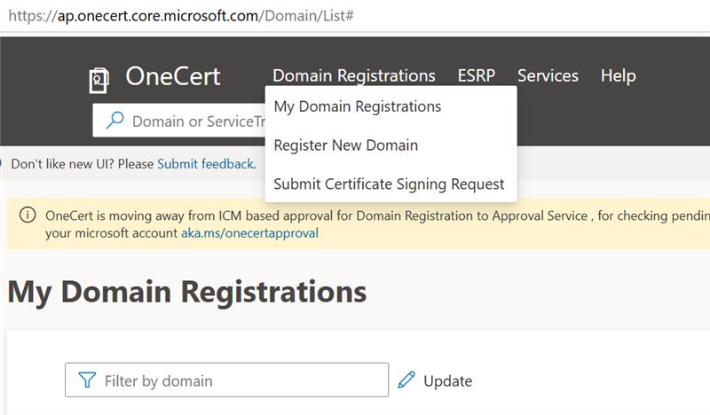
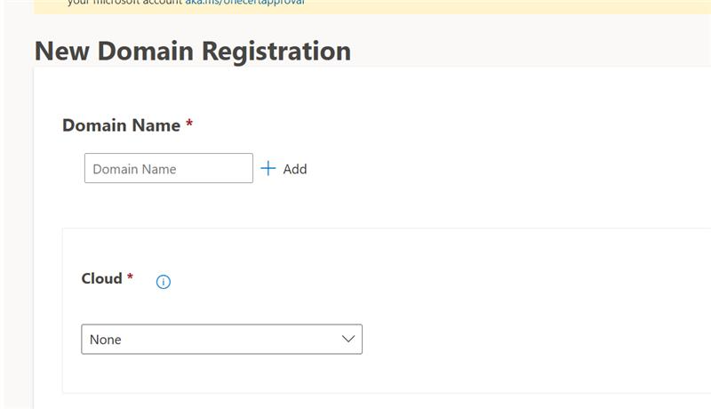
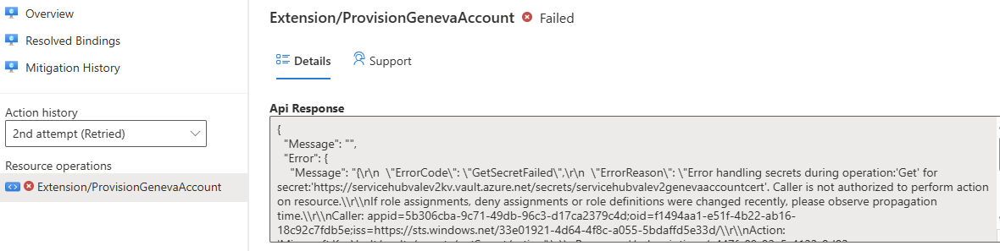
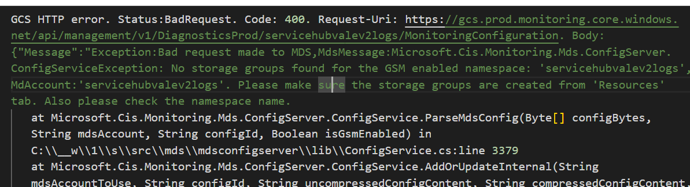

# Geneva Logs Set Up

- [Geneva Set Up](#geneva-set-up)
  - [Introduction](#introduction)
  - [Required Steps for Set Up](#required-steps-for-set-up)
    - [Step 1: Register domain](#step-1-register-domain)
      - [Prerequisites](#prerequisites)
      - [Instructions](#instructions)
    - [Step 2: Create the build and release pipelines](#step-2-create-the-build-and-release-pipelines)
    - [Step 3: Run the build and release pipelines for global resources](#step-3-run-the-build-and-release-pipelines-for-global-resources)
      - [Error 1: Ev2 Pipeline Cert Access](#error-1-ev2-pipeline-cert-access)
      - [Error 2: No storage groups found for the GSM enabled namespace](#error-2-no-storage-groups-found-for-the-gsm-enabled-namespace)
      - [Error code 500](#error-code-500)
    - [Step 4: Run the Build and Release Pipelines for Shared Resources](#step-4-run-the-build-and-release-pipelines-for-shared-resources)

## Introduction

Geneva Monitoring platform enables services to do Monitoring, Diagnostics and Analytics at scale. We have (mostly) the initial set up automated for the logs from your service to show up in a kusto (azure data explorer) cluster. There are a few manual steps, but we will explain them in detail.

Here are the manual steps to anticipate through this process.

Currently, only part of the process is automated.

Note that this wiki does not **explain** the steps in detail. It just covers the setup.

## Required Steps for Set Up
### Step 1: Register domain
#### Prerequisites

**You can only do this step on your SAW.** Even if you are setting up a build and release pipeline for non-prod, the OneCert portal can only be accessed through your SAW.

#### Instructions

1. Navigate to [aka.ms/onecert](aka.ms/onecert) on your SAW. This takes you to the OneCert portal. Please click on "Domain Registrations" in the top menu, then select "Register New Domain" from the dropdown that appears.

1. You will now be required to input values. **We provide the values to you.** All of the values you need to input are in [onecert.yaml](./onecert.yaml). The value that you will need to replace is "Owners", where you should replace it with your AME account and your team's prod security group.

If you have an **existing subscription** you are using, you will likewise need to input this subscription, which should also be the designated subscription for your geneva account.

For prod, if you are using an existing subscription, refer to the [Subscription Registration/Backfill docs](https://ev2docs.azure.net/features/service-artifacts/actions/subscriptionProvisioningParameters.html?q=subscription%20provisioning#subscription-registrationbackfill) or contact chamakawa@microsoft.com for further steps. You will need to modify the Ev2 files to indicate that you will be using a backfilled/existing subscription.

For test, just ensure that you have added the subscription id to your domain registration. Make sure to follow the "PublicMSFT (test)" instructions.

Refer to the [OneCert docs](https://eng.ms/docs/products/onecert-certificates-key-vault-and-dsms/key-vault-dsms/onecert/docs/registering-a-domain-in-onecert) for official OneCert documentation.

### Step 2: Create the build and release pipelines

Please refer to [Ev2_README.md](./Ev2_README.md) for how to create the build and release pipelines.

TODO: Remove this section in the future since this part will be automated.

### Step 3: Run the build and release pipelines for global resources

When you run the release for production, you will **need** a release approval.

Once the release is approved and the pipeline is running, you will face two errors in the Ev2 portal when you run the release. We will detail how to resolve them in the Ev2 Portal. Refer to [Ev2_README.md](./Ev2_README.md#to-view-your-rollout-in-the-ev2-portal) on how to view your rollout in the Ev2 Portal.

#### Error 1: Ev2 Pipeline Cert Access

The error will be "Error handling secrets during operation:'Get' for secret...Caller is not authorized to perform action on resource. The first failure will state that Ev2 does not have access to the cert."

##### Test Corp

If you are deploying to the Corp (MS CORP) tenant, then you will need to create a role assignment to give the service principal that is tied to your AAD security group 'Key Vault Secrets User' permissions in the subscription you are deploying to. This will be the backfilled subscription you specified for test. 

You will only encounter this error once. Click retry.

##### Prod AME

This will occur nearly every time you decide to update the Geneva Logs account. Why does this happen? It's because we cannot grant certain roles to the security group that does the Ev2 release, so the permissions are limited.  So, **whoever approved the pipeline release** will need to create a JIT request.

So, the general steps to address this are:

1. Get the subscription ID of the subscription that was provisioned. Please find the subscription ID that is associated with AKS Service Hub Validation Sub - global. You can find the provisioned subscription in the Ev2 Rollout Link by clicking Deployment -> Details and looking at the Subscription ID. You can also check the Azure Portal using your SAW.
2. The approver of your release will need to make a JIT request with the details specified in [jitGenevaAccount.yaml](./jitGenevaAccount.yaml).

After the JIT request is submitted and approved, you will need to click "Retry" in the Ev2 Portal for the `ProvisionGenevaAccount-eastus2` step. [Here](https://ev2docs.azure.net/features/rollout-management/retry-skip.html?q=retry&tabs=tabid-1#manual-retry-or-skip) are the steps on how to do a manual retry. Since JIT access lasts for a period of time, you will not face this error again until the JIT access expires, or you re-run a release and a different approver approves the release.

Refer to [role assignment issues in ev2](https://ev2docs.azure.net/TroubleShooting/general/role-assignment-issues.html#solution-2) for more information.

#### Error 2: No storage groups found for the GSM enabled namespace

If you are running this pipeline **for the first time**, this **will likely** fail at the geneva account creation step with the logs/error "No storage groups found for the GSM enabled namespace...Please make sure the storage groups are created from 'Resources' tab. Also please check the namespace name". The is due to the geneva acount logs ev2 extension not waiting for the storage groups to be created before validating. Geneva resource provisioning occurs as part of the Geneva Logs account creation process. You may need to wait 5-25 minutes before selecting "Retry" for this step again. You will not face this step again after the pipeline runs successfully for the first time.

To verify if the storage groups have been created before retrying, check the resource group named "GenevaWarmPathManageRG." This resource group contains resources provisioned and managed by Geneva This is the resource group that contains resources provisioned and managed by Geneva. For production, it will be located in your global subscription (e.g., AKS Service Hub Validation Sub - global).

If you are deploying to production, you will need to select "Retry" from your SAW.

#### Error code 500

If you run into errors with the error code "500", just select "Retry". If you are deploying to production, you will have to select "Retry" from your SAW to have the permissions to do so. If it continues to persist, you'll need to reach out to the [Geneva team](https://teams.microsoft.com/l/channel/19%3A2eafe132e70340c1aa2b2755bc3ad45d%40thread.skype/Geneva%20Ev2?groupId=5658f840-c680-4882-93be-7cc69578f94e&tenantId=72f988bf-86f1-41af-91ab-2d7cd011db47) since it is caused by their internal server.

### Step 4: Run the Build and Release Pipelines for Shared Resources

To release to production, a **release approval** is required.

Once the pipeline is executed, the Geneva agents will be deployed. However, logs will only appear in the Kusto database after your services have been deployed. Therefore, you must also run your service pipelines to ensure logs are generated and forwarded to the database.
