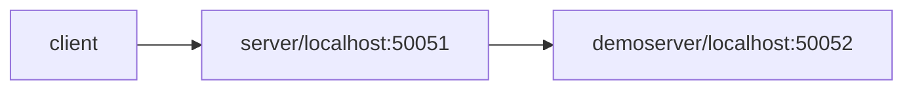

# mygreeterv3

## Prerequisites


- Follow the instructions in [../README/README.md](../README/README.md) to setup the generated service and make sure it can run. It involves creating developer's own environment that is isolated from other developers, provisioning the shared resources, provisioning the service specific resources, and initializing the service.

## Code Overview

This directory stores a complete microservice. It has two Go modules.

### api

This module stores the microservice's API definition.

- The API is defined through [protobuf](https://grpc.io/docs/languages/go/quickstart/). The gRPC method is annotated to provide the following features.
  - option (google.api.http) and option (grpc.gateway.protoc_gen_openapiv2.options.openapiv2_operation). By declaring the HTTP mapping and OpenAPI documentation, the [grpc-gateway](https://github.com/grpc-ecosystem/grpc-gateway) module can generate a reverse proxy that expose the gRPC microservice as an HTTP service. It also generate a swagger.json OpenAPI document. Through the [swagger-codegen-cli](https://swagger.io/docs/open-source-tools/swagger-codegen/), the Makefile further generates an HTTP client library (restsdk) based on the swagger.json.
  - buf.validate. By declaring the field constraints, the [protovalidate](https://github.com/grpc-ecosystem/go-grpc-middleware/tree/main/interceptors/protovalidate) middleware will automatically enforce the field constraints.
  - servicehub.fieldoptions.loggable. By declaring if a field is false for logging, the [aks-middleware](https://github.com/Azure/aks-middleware/blob/main/ctxlogger/ctxlogger.go) will not log this field. By default, all fields will be logged automatically.
- client. It provides a function to create a gRPC client to talk with this microservice. The client enabled the following [default interceptors](https://github.com/Azure/aks-middleware/blob/main/interceptor/interceptor.go)
  - Auto retry. Automatically retry the failed request if the error is retryable.
  - metadata forwarding. It forwards information such as request id so that we can correlate requests across microservices.
  - Request logging. Each request will be logged once. QoS dashboard uses the logs to show qps, latency, error ratio, etc.
- mock. This is auto generated. All mock functions of the API are generated so that users can use the mock directly in their unit test rather than each user implements their own mock.
- restsdk. This is auto generated. Users can use this SDK to access the HTTP API instead of making raw HTTP requests directly.

### server

This module stores the implementation of the microservice.

- source code. The Go source code are in cmd and internal. They follow the guideline in [Go project layout](https://github.com/golang-standards/project-layout). Three binaries will be built out of the source code. See [Run Service Locally](#run-service-locally) for details.
  - client. The client binary demonstrated how to use the microservice's client library (gRPC client and restsdk) to call the gRPC service and HTTP service.
  - server. The server binary is the key microservice. It demonstrates how a full-blown microservice works.
    - Accepting gRPC calls and HTTP/REST calls.
    - Making calls to its dependency to fullfil incoming calls. The dependency can be a gRPC service, an HTTP service such as Azure, or something else. When it is Azure, it demonstrates how the code can assume an Azure identity and gain access to Azure.
    - The server is configured with both server interceptors (for incoming calls) and client interceptors (for outgoing calls). See details at [default interceptors](https://github.com/Azure/aks-middleware/blob/main/interceptor/interceptor.go). The buf.validate and servicehub.fieldoptions.loggable annotations in the protobuf need to work with the interceptors to be effective.
  - demoserver. The demoserver is purely for handling calls from the server binary so that the server binary can demonstrate its outgoing calls to another gRPC service.
  - async. The async binary processes asynchronous operations (which are typically long-running) by using a processor with handlers provided by the [aks-async](https://github.com/Azure/aks-async) library.
    - This component does not receive gRPC calls, rather grabs operations directly from a connected Azure Service Bus resource in order to process them accordingly.
    - Async also utilizes an Azure SQL Server created by the service specific resources earlier, and it uses the url or connection string with the name of the specific database to connect to it.
	  - The database is created by the bicep files and deployed in the deployment of service specific resources. The entityTableName might not be created yet (since the table is created by the server and async and server should initialize simultaneously) but that doesn't matter because if the entityTable hasn't been created, it means that the server hasn't started and async should not be receiving any messages through the service bus to process.
- deployments. The deployments are via [Helm](https://helm.sh/).
  - The three binaries are deployed as k8s deployments. The server and the demoserver are exposed as k8s service (ClusterIP).
  - To grant Azure managed identity to the server microservice, [AKS workload identity](https://learn.microsoft.com/en-us/azure/aks/workload-identity-deploy-cluster) is used. It involves multiple components.
    - Shared resource: The AKS cluster needs to enable this feature.
    - Service resource: Managed identity needs to trust the AKS cluster as an OIDC issuer. The managed identity output its client ID.
    - K8s service account: Annotate with the managed identity's client id so that the service account will assume the managed identity when talking with Azure.
    - K8s pod spec: Run with the identity of the above k8s service account.
    - Shared resource deployment and service resource deployment are handled separately. Helm deployment only handles k8s resources.
  - [Istio](https://istio.io/latest/) is used to enforce mutual TLS (PeerAuthentication) and microservice method level access control (AuthorizationPolicy).
- resources. This directory stores service resources only.
  - The managed identity and its role assignment. The managed identity is used by the microservice.
  - Each method's QoS (throughput, error ratio, latency) alert. They are logAnalyticsWorkspace scheduled-query-rule.
  - For shared resources and resources in general, see [../README/README.md](../README/README.md)
- test. This is the integration test. Multiple scripts are defined to finish the build, release, test cycle. There are three levels of automation in ascending order: 1) make, 2) run the scripts, or 3) run the `Service Resource And Code Development Pipeline`. Each level wraps more steps from the previous level and provides more automation. As a developer, you can use any of them depending on if you want to see the results faster or you want less typing.
- monitoring. This folder stores the QoS dashboard. Please follow the README.md in the directory to create your dashboard. The dashboard will only show data from your instance defined in env-config.yaml.
  - Another part of the monitoring is alert. They are defined as service resources.
- Ev2. See [../README/Ev2_README.md](../README/Ev2_README.md)

## Middleware

The service leverages multiple middleware for features such as logging, retry, and input validation. To learn more, please visit the [middleware repo](https://github.com/Azure/aks-middleware/tree/main).

## Modify the API

Follow the links in [Code Overview](#code-overview) to understand how protobuf and gRPC works. Then you can modify the methods/API of the microservice.

Whenever the API is changed, you need to run the following command to regenerate the code.

```bash
cd api/v1
make service
```

If you use go.work (make build-workspace-image), your local update will be used directly.

If you don't use go.work ((make build-image)), you need to commit your generated code to the repo and tag it. See instructions in [./init.sh](./init.sh).

### gRPC and code generation from protobuf

- [Define a Service in proto file](https://protobuf.dev/programming-guides/proto3/#services)
  - [Define a Message Type in proto file](https://protobuf.dev/programming-guides/proto3/#simple)
- [Use buf.gen.yaml to generate code from protobuf](https://buf.build/docs/configuration/v1/buf-gen-yaml#plugins)
  - [Buf Schema Registry (BSR)](https://buf.build/plugins)
  - [Documentation on remote plugins](https://buf.build/docs/generate/remote-plugins)

## Run Service Locally

Deploying the changed service to Azure such as an AKS cluster for a complete modify-test cycle is slow. You can run the service on our local machine to speed up the development cycle.

**Inside the mygreeterv3/server directory, you can run the client, the server, and the demoserver.**

### Server

The following command runs the server with minimal functionality. The server starts to serve on the default address `localhost:50051` and the enable-azureSDK-calls flag is set to false. In this case, only the sayHello method works. It is served directly by the server. It won't call Azure either.

```bash
go run dev.azure.com/service-hub-flg/service_hub_validation/_git/service_hub_validation_service.git/mygreeterv3/server/cmd/server start 
```

The following command runs the server with the azureSDK calls enabled. Because the code runs on your local machine, your identity is used to call Azure. You need to have enough permissions on the subscription to allow the server to call Azure successfully. Otherwise the server will report permission errors.

```bash
go run dev.azure.com/service-hub-flg/service_hub_validation/_git/service_hub_validation_service.git/mygreeterv3/server/cmd/server start \
    --enable-azureSDK-calls true --subscription-id <sub_id>
```

The following command runs the server that will call the demoserver's sayHello method. This is to demonstrate gRPC calls from one service to another. --remote-addr <remote_addr> is demoserver's serving address.

```bash
go run dev.azure.com/service-hub-flg/service_hub_validation/_git/service_hub_validation_service.git/mygreeterv3/server/cmd/server start \
    --remote-addr localhost:50052
```

### Demoserver

When the server needs to call demoserver, you need to start the demoserver in a different port. Otherwise, both server and demoserver will try to use the same port and cause conflict.

The following command runs the demoserver on a specific port 50052.

```bash
go run dev.azure.com/service-hub-flg/service_hub_validation/_git/service_hub_validation_service.git/mygreeterv3/server/cmd/demoserver start \
    --port 50052
```

### Client

The following command runs the client which will repeatedly calls the service on `localhost:50051`. Using the example above, it will calls the server.

```bash
go run dev.azure.com/service-hub-flg/service_hub_validation/_git/service_hub_validation_service.git/mygreeterv3/server/cmd/client hello
```

The following command runs the client which will repeatedly calls the service on `localhost:50052`. Using the example above, it will calls the demoserver.

```bash
go run dev.azure.com/service-hub-flg/service_hub_validation/_git/service_hub_validation_service.git/mygreeterv3/server/cmd/client hello --remote-addr localhost:50052
```

### Big picture on a local machine



### Help

You can get help about every command.

Examples:

```bash
go run dev.azure.com/service-hub-flg/service_hub_validation/_git/service_hub_validation_service.git/mygreeterv3/server/cmd/client help

go run dev.azure.com/service-hub-flg/service_hub_validation/_git/service_hub_validation_service.git/mygreeterv3/server/cmd/demoserver start -h
```


## Resource Provisioning

### Shared Resources

Shared resources are resources that are used by multiple micro-services. One example resource is AKS cluster. Multiple micro-services will use the same AKS cluster.

Before creating any service resource, please check [Create or Update Shared Resources](../shared-resources/README.md) to create shared resources. The shared resources are referenced by the service resources. If the shared resources are not created, the service resource provisioning won't be able to find them.

### Service Resources

Service resources are resources that are used by the service only. One example resource is Managed Identity used by each service. Each service will have their own Managed Identity to isolate them.

To deploy the resources:

```bash
# Assume the current directory is the generated directory.
cd mygreeterv3/server

# Templates env-config.yaml values into all the required files.
# We assume env-config.yaml exists in your generated directory.
make template-files

# Create service specific resources
# It takes 5-10 minutes
make deploy-resources
```

[Optional] Should you want to modify the parameter values for the bicep resources, follow the instructions in [Making changes to Bicep Resources](../README/README.md).

### View All Resources and Dependencies

See [resources.md](resources.md). This provides a high-level overview of all your deployments.

This file will only exist after you have run `make deploy-resources`. To see the resources you have created and their dependencies, click the different links in this file. Each link is a different markdown file that is associated with a bicep deployment. Each bicep deployment associated file has:

- list of resources you have created via bicep file
- links to the resources in Azure portal
- the dependencies of each resource

| Resource Created | Feature | Shared vs Service |
|----------|----------|----------|
| Resource Group | N/A | Shared |
| AKS Cluster | N/A | Shared |
| Azure Container Registry | N/A | Shared |
| Resource Role Assignment | N/A | Shared |
| Log Analytics Workspace | Monitoring | Shared |
| Data Collection Rule | Monitoring | Shared |
| Alert Rules | Monitoring | Service |
| Managed Identity | AzureSDK | Service |
| Subscription Role Assignment | AzureSDK | Service |

## Deploy Service to Cluster

### Steps

It follows the same steps as in [../README/README.md](../README/README.md). Here is a copy for reference.

```bash
# Assume the current directory is the generated directory.
cd serviceDirectoryName

# Initialize the service. 
# Only need run once for freshly generated code or when something is wrong.
./init.sh

cd server

# Templates env-config.yaml values into all the required files.
# Assume env-config.yaml exists in your generated directory.
make template-files

# Create service specific resources
# It takes 5-10 minutes
make deploy-resources

# Build image (can be done in parallel with deploy-resources). 
# If you are using macOS, building a Docker image locally won't work
# because we currently don't support cross-platform build. 
# Instead, you need to use DevBox to build the Docker image.
# If you do not have a DevBox set up, please follow the instructions in 
# https://msazure.visualstudio.com/CloudNativeCompute/_wiki/wikis/CloudNativeCompute.wiki/358303/Dev-Box

# This is the production build process where a specific api module version is used.
# Make sure your api module is tagged to the right version in the repo.
make build-image

# If you want to build the image to be multi-architecture (linux/arm64 and linux/amd64) use the following command. It currently uses the fixed tagged api module.
make build-multiarch-image

# This is the debug build process where the latest api code is used.
# It uses go.work to achieve that.
make build-workspace-image

# Push image to acr. 
# Need to wait for the finish of `make deploy-resources` of
# the shared resources where acr is created.
make push-image

# (If svc running on aks cluster) Upgrade service on AKS cluster
make upgrade
# (If svc not running on aks cluster) Deploy service to AKS cluster
make install

# Refresh your bashrc such that your terminal has updated kubeconfig
source ~/.bashrc
```

### Command Explanation

- ./init.sh
  - For this Go based service, it initializes the two Go modules: api and server.
  - For the api module, it generates code from protobuf and make the module useable.
  - For the server module, it creates go.work so that the server can use the local code of the api module.
  - For both, build and test to make sure the code is ready to use.
- make deploy-resources
  - Deploy the service resources.
- make build-image
  - Build the docker image with a specific version of the api module.
  - [Dockerfile](server/Dockerfile): Its build context (input directory) is mygreeterv3/server. Only the code in this directory is needed. The api module is retrieved with the version defined in go.mod.
- make build-multiarch-image
  - Build the same docker image as above, however as a multi-architecure (linux/arm64 and linux/amd64) image.
- make build-workspace-image
  - Build the docker image with the latest api code.
  - [Dockerfile](server/Dockerfile_workspace): Its build context (input directory) is mygreeterv3. The go.work file, the api directory, and the server directory are all used. The version of the api module defined in go.mod is ignored. The latest code in the api directory is used.
- make push-image
  - Push the image to the ACR which is a shared resource.
- make upgrade or make install
  - Connect to the AKS cluster (a shared resource) and deploy the services to the cluster.
  - Connect resources with code. One example is the managed identity created as service resources. After creating the managed identity, the identity's client ID needs to be passed into k8s service account. Through this client ID, AKS workload identity can let the code/service account assume the identity of the managed identity.
    - Under the hood, service resource provisioning output the client ID in the artifacts directory. This command takes the client ID information and put it in the k8s service account manifest.

### Check if Service Deployment is Successful

You may need wait a few minutes before pods are created and logs show up.

If you do not have kubectl installed you can run these commands to set up the docker container with an environment that will allow you to run the kubectl commands.

```bash
# Assuming you are at the root of the generated directory (the one that contains mygreeterv3)
export src=$(pwd)
docker run -it --mount src=$src,target=/app/binded-data,type=bind servicehubregistry.azurecr.io/service_hub_environment:$20250228 /bin/bash
# Once you are in the container
export KUBECONFIG=app/binded-data/mygreeterv3/server/.kube/config
```

Once inside the container or on your local machine that has kubectl installed

Server:

```bash
# check if pod is running
kubectl get pods -n servicehubval-mygreeterv3-server

# check logs
export SERVER_POD=$(kubectl get pod -n servicehubval-mygreeterv3-server -o jsonpath="{.items[0].metadata.name}")
kubectl logs $SERVER_POD -n servicehubval-mygreeterv3-server
```

Demoserver:

```bash
# check if pod is running
kubectl get pods -n servicehubval-mygreeterv3-demoserver

# check logs
export DEMOSERVER_POD=$(kubectl get pod -n servicehubval-mygreeterv3-demoserver -o jsonpath="{.items[0].metadata.name}")
kubectl logs $DEMOSERVER_POD -n servicehubval-mygreeterv3-demoserver
```

Client

```bash
# check if pod is running
kubectl get pods -n servicehubval-mygreeterv3-client

# check logs
export CLIENT_POD=$(kubectl get pod -n servicehubval-mygreeterv3-client -o jsonpath="{.items[0].metadata.name}")
kubectl logs $CLIENT_POD -n servicehubval-mygreeterv3-client
```


## Debugging and Common Failures


## Monitoring

To view your service in Azure Data Explorer (ADX), follow [ADX dashboard creation/update instructions](server/monitoring/README.md).
